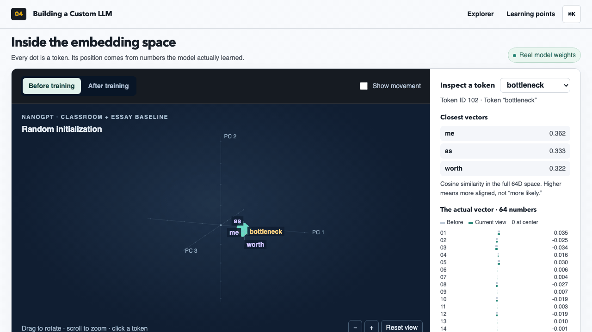
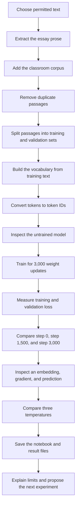
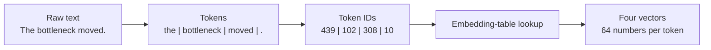
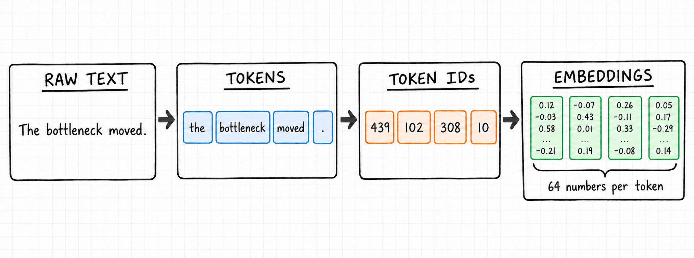
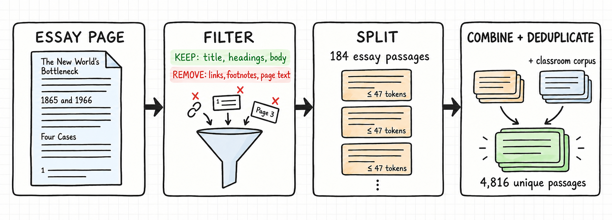
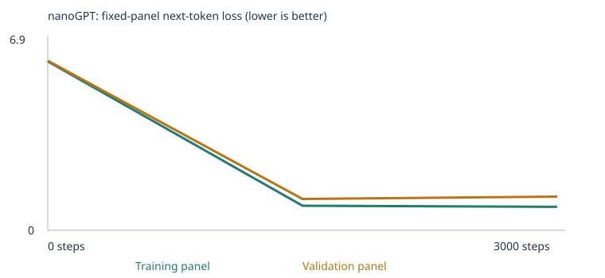
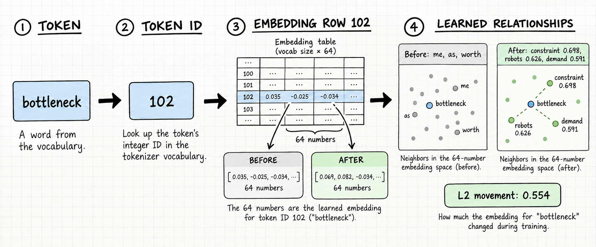

# Assignment 3 — Create a Small Language Model

This repository contains my completed language-model experiment. I used the supplied nanoGPT notebook. I trained the model from random weights.

The training data contains the classroom corpus and the main prose from my essay, [“The New World’s Bottleneck”](https://hanif.info/posts/the-new-worlds-bottleneck.html).

The model is small. It has 135,936 parameters. It uses word and punctuation tokens. It is not a general chatbot.

This README explains each process in the experiment. It also gives the measured results from the final run.

## Files to inspect

- [Executed notebook](custom_llm.ipynb)
- [Assignment plan](ASSIGNMENT_PLAN.md)
- [Assignment context](assignment-context.md)
- [Final experiment files](results/essay-baseline/)
- [Experiment configuration](results/essay-baseline/config.json)
- [Corpus manifest](results/essay-baseline/corpus_manifest.json)
- [Vocabulary report](results/essay-baseline/vocabulary_report.json)
- [Tokenization evidence](results/essay-baseline/tokenization.json)
- [Model inspection evidence](results/essay-baseline/inspection.json)
- [Loss history](results/essay-baseline/history.json)
- [Training data table](results/essay-baseline/training.csv)
- [Training summary](results/essay-baseline/training_summary.json)
- [Temperature comparison](results/essay-baseline/temperature_comparison.json)
- [Embedding viewer](embedding-viewer.html). Load [checkpoint.json](results/essay-baseline/checkpoint.json) in the viewer.

## Visual proof of training



The GIF uses the recorded initial and final embedding tables from this experiment checkpoint. It selects `bottleneck`, then compares its local relationships before and after 3,000 training steps. PCA compresses the 64-number vectors into a 3D display; the neighbor scores stay calculated in the original 64-dimensional space. This is an embedding-space view of what the corpus taught the model, not a raw corpus co-occurrence graph or proof of general semantic understanding.

## Process map



## Terms used in this experiment

| Term | Meaning | Example from this experiment |
| --- | --- | --- |
| Corpus | The complete collection of training text. | The classroom text and essay prose form the corpus. |
| Token | One word or punctuation mark. | `bottleneck` and `.` are tokens. |
| Token ID | The integer that represents one token. | `bottleneck` has token ID 102. |
| Vector | A list of numbers. | Each token vector contains 64 numbers. |
| Embedding | A learned vector for one vocabulary item. | Row 102 of the embedding table represents `bottleneck`. |
| Weight | A number that the neural network can change. | The model has 135,936 trainable parameters. |
| Loss | A measurement of prediction error. | A smaller loss means a better next-token prediction. |
| Gradient | A value that shows how a parameter can change the loss. | AdamW uses the gradient to update a parameter. |

## Tokenization process

The tokenizer changes text into a form that the model can process. It converts the text to lowercase. It then divides the text into word and punctuation tokens. The vocabulary replaces each token with its token ID. The embedding table maps each token ID to a vector of 64 numbers.

The following example uses actual token IDs from the final vocabulary.





## Step 1 — Select the corpus

I set `CORPUS = "classroom"`. This setting combines the supplied classroom sentences with permitted files in the `corpus/` folder.

I added the title, headings, and main body of my published essay. I excluded citations, footnotes, URLs, navigation text, image labels, and acknowledgements.

I directed and edited the essay. AI tools helped with brainstorming, outlining, editing, and some generated passages. I reviewed the final text before I published it. The corpus is not evidence of my unaided writing style.

The classroom corpus contains repeated sentence patterns. These patterns make model learning easy to inspect. The essay adds terms about AI, constraints, automation, productivity, and demand.

## Step 2 — Extract and check the corpus

The extraction script downloaded the public essay page. The script selected the main article text. It stopped before the footnotes and page material.

The extraction produced no warnings. The [corpus manifest](results/essay-baseline/corpus_manifest.json) contains the source name, file hash, preview, and passage counts.

The sketch shows the extraction sequence. The script filters the essay before the notebook creates passages and combines the corpora.



| Corpus measurement | Result |
| --- | ---: |
| Essay characters | 16,620 |
| New essay passages | 184 |
| Classroom passages before deduplication | 6,360 |
| Combined unique passages | 4,816 |
| Removed duplicate passages | 1,728 |

The notebook divides long text into passages. Each passage contains no more than 47 word or punctuation tokens.

## Step 3 — Select the training settings

| Setting | Value | Reason |
| --- | --- | --- |
| Corpus | Classroom corpus plus essay prose | This mix gives clear classroom patterns and essay vocabulary. |
| Training steps | 3,000 | This is the recommended final training budget. |
| Learning rate | `0.001` | This is the recommended initial learning rate. |

The notebook uses learning-rate warmup and cosine decay. A very large learning rate can move past useful parameter values. A very small learning rate can produce too little learning in 3,000 steps.

I first completed a separate 10-step setup test. I did not use that test as the final experiment.

## Step 4 — Write the prediction before training

I predicted that the training loss and the validation loss would decrease. I expected the model to learn associations between `bottleneck`, `constraint`, `automation`, `demand`, and `AI`.

I expected the generated text to remain repetitive or incomplete. I expected low-temperature output to be more predictable. I expected high-temperature output to have more variation.

## Step 5 — Remove duplicates and split the passages

The notebook removed duplicate passages before the split. It then used 90% of the passages for training and 10% for validation.

| Split | Passages |
| --- | ---: |
| Training | 4,334 |
| Validation | 482 |

Validation passages did not update the model weights. However, passages from the same essay can occur in both sets. This split does not test a completely new source document.

## Step 6 — Build the vocabulary and create token IDs

The notebook built the vocabulary only from the training text. It kept the 509 most frequent training token types. It also added `<UNK>`, `<BOS>`, and `<EOS>`.

| Vocabulary measurement | Result |
| --- | ---: |
| Vocabulary entries | 512 |
| Training token types before the limit | 1,022 |
| Training unknown-token rate | 1.02% |
| Validation unknown-token rate | 1.61% |

`<UNK>` replaces a token that is not in the vocabulary. Both unknown-token rates are below the notebook warning level of 5%. See the [vocabulary report](results/essay-baseline/vocabulary_report.json) and [tokenization evidence](results/essay-baseline/tokenization.json).

## Step 7 — Inspect the model before training

The notebook created the model with random parameter values. The model had not learned the corpus at step 0.

The untrained loss was approximately 6.25. The next-token probabilities were almost flat. The generated samples were random and mostly incoherent.

The notebook saved this state. This state gives a fair starting point for the later comparisons.

## Step 8 — Train the model

The notebook used each training batch to complete this process:

1. Convert passages into token IDs.
2. Read the token and position embeddings.
3. Use causal attention to process earlier tokens.
4. Calculate next-token probabilities.
5. Compare the probabilities with the correct next tokens.
6. Calculate cross-entropy loss.
7. Use backpropagation to calculate gradients.
8. Use AdamW to update the parameters.
9. Repeat the process for the next batch.

The final run completed all 3,000 updates. The run had no interruption and no notebook error.

| Run fact | Result |
| --- | --- |
| Training time | 19.19 seconds |
| Device | Apple Silicon CPU on macOS arm64 |
| Python | 3.9.6 |
| PyTorch | 2.8.0 |
| Parameters | 135,936 |
| Transformer blocks | 2 |
| Attention heads | 4 |
| Embedding size | 64 numbers |
| Context limit | 48 tokens |
| Batch size | 32 passages |
| Random seed | 42 |
| Loss panels | 20 training and 20 validation passages |

See the [configuration](results/essay-baseline/config.json), [training summary](results/essay-baseline/training_summary.json), and [training table](results/essay-baseline/training.csv).

## Step 9 — Measure the loss

The notebook used the same fixed loss panels at each measurement. Each panel contains 20 passages. The panel results are estimates and are not full-corpus measurements.



| Step | Training loss | Validation loss |
| ---: | ---: | ---: |
| 0 | 6.2454 | 6.2732 |
| 1,500 | 0.9090 | **1.1599** |
| 3,000 | **0.8691** | 1.2489 |

Both losses decreased substantially from step 0. The training loss continued to decrease after step 1,500. The validation loss increased after step 1,500. This difference is evidence of overfitting.

See the complete values in the [loss history](results/essay-baseline/history.json).

## Step 10 — Compare the generated samples

The notebook used the same generation settings and random seed for each checkpoint. I kept all saved samples.

### Step 0 — Before training

```text
growing four price what someone southeast 000 bond week hold bottlenecks day first tutor replace teacher kept our dentist they're lesson grew developer doesn't language bus 003 cheap nurse doctor quadrant productivity
test volume operations management it productivity called demand hour what system efficiency competing needed higher do times enough harvest so cut payment consumption iese over went kept hold constraint right educator standing
doing application leisure advance office checking five power keep replaced than paradox compared interest power fall my expects disappear barely factory learning 000 and 1930 sitting as code against update teaching capital
development both as 2000 business well growing barely always seven 700 purchase operations jobs 1865 gain efficient will increased second technology % whose mango speed fulfillment expects 65 think lecturer booking leisure
```

### Step 1,500 — Halfway through training

```text
our office has a question about the new platform and update .
the new teacher was mentioned in the lesson report yesterday .
the different lecturer was mentioned in the learning report yesterday .
today the kitchen focused on juice and the new pear .
```

### Step 3,000 — After training

```text
our office has a question about the new platform and update .
the new teacher was mentioned in the lesson report yesterday .
the different lecturer was mentioned in the learning report yesterday .
today the kitchen focused on juice and the new pear .
```

The output changed from random token sequences to grammatical classroom patterns. The halfway samples and final samples are identical. The classroom data contains most of the corpus passages. Therefore, the classroom patterns dominate unconditional generation.

Open the complete sample files: [step 0](results/essay-baseline/samples/step_0000.txt), [step 1,500](results/essay-baseline/samples/step_1500.txt), and [step 3,000](results/essay-baseline/samples/step_3000.txt).

## Step 11 — Inspect one token and its embedding

The token `bottleneck` has token ID 102. The ID selects row 102 from the token-embedding table.

The sketch shows the lookup from the token to embedding row 102. It also shows how the vector and its nearest neighbors changed during training.



The initial 64-number vector was:

```text
[0.035419, -0.024861, -0.033798, 0.016063, 0.030064, 0.006256, 0.003740, -0.026716, 0.006811, -0.019389, 0.003402, -0.018591, 0.009643, -0.000871, -0.002581, -0.016245, -0.003216, -0.016645, -0.007848, 0.010776, 0.007726, 0.021869, 0.009092, -0.030755, 0.003980, -0.020058, 0.009821, 0.036219, 0.011011, 0.023682, -0.002374, 0.066848, 0.012474, 0.004746, 0.020280, -0.013166, 0.000638, -0.017028, 0.031372, -0.009318, 0.022383, -0.055197, -0.003421, 0.043838, -0.005655, -0.012928, 0.013297, 0.011505, 0.009411, -0.001589, 0.040475, 0.001756, -0.024022, 0.006817, 0.003673, 0.027728, -0.004083, -0.028540, 0.031490, -0.028373, -0.036345, -0.007140, -0.012994, 0.024005]
```

The final 64-number vector was:

```text
[0.068656, 0.082031, -0.034321, 0.033582, 0.090589, -0.067067, -0.006640, -0.126530, 0.076109, -0.034191, -0.072049, -0.040752, -0.032658, -0.082250, -0.032250, -0.074602, -0.012225, 0.138816, -0.015833, -0.031648, 0.005062, 0.018145, -0.066763, -0.000484, 0.031893, -0.041422, 0.097606, -0.120253, -0.025560, 0.021735, -0.121269, 0.056348, -0.022233, 0.068526, -0.039007, -0.032880, -0.017601, -0.057959, 0.085169, 0.044746, 0.089640, -0.091771, -0.023619, -0.013487, -0.108967, 0.005416, 0.084398, -0.002341, 0.179212, 0.056590, 0.141069, -0.023122, 0.095388, -0.169652, 0.047897, 0.029745, 0.095627, -0.029272, 0.145983, 0.002309, -0.026448, 0.087856, -0.049736, 0.059411]
```

The vector moved by an L2 distance of approximately 0.554. Before training, its nearest words were random words such as `me`, `as`, and `worth`. After training, the nearest words included `constraint` (0.698), `robots` (0.626), `same` (0.612), `demand` (0.591), and `matrix` (0.567).

These relationships match repeated contexts in the essay. They do not prove general semantic understanding. See the [inspection evidence](results/essay-baseline/inspection.json) and [checkpoint](results/essay-baseline/checkpoint.json).

## Step 12 — Inspect one gradient and parameter update

Cross-entropy loss penalizes a low probability for the correct next token. Backpropagation calculates the gradient for each parameter. AdamW uses the gradient, optimizer state, weight decay, and learning rate to update the parameter.

The first update changed coordinate 0 of the `bottleneck` embedding:

| Measurement | Value |
| --- | ---: |
| Parameter before the update | 0.0354193784 |
| Gradient | 0.0046224012 |
| Warmup learning rate | 0.0000100000 |
| Parameter after the update | 0.0354093760 |

The parameter decreased by a small amount. The change is not equal to only `learning rate × gradient`. AdamW also uses its optimizer state and weight decay.

## Step 13 — Inspect next-token probabilities

The notebook used the prefix `the bottleneck`.

Before training, the prediction distribution was almost flat. The highest entries included `bottleneck` at 0.402%, `keep` at 0.297%, and `reviewed` at 0.294%.

After training, the distribution changed. The highest entries included `didn't` at 7.386%, `moved` at 4.807%, `engineers` at 2.014%, `shifts` at 1.946%, and `rather` at 1.946%.

The changed probabilities show that training changed the model predictions. The model did not retrieve a stored essay response.

## Step 14 — Explain attention and generation

The model combines each token embedding with a position embedding. It then sends the values through two transformer blocks.

Causal self-attention lets each token position assign weight to earlier positions. The causal mask prevents the model from reading future tokens. The context window contains no more than 48 tokens.

The final model values become logits. Softmax converts the logits into next-token probabilities. The generator samples one token ID from these probabilities. It adds the new token ID to the context and repeats the process.

## Step 15 — Compare temperature values

Temperature changes the sampling distribution. It does not change the model weights. It does not retrain the model.

The model, start token, seed, and sampling procedure stayed fixed. Only the temperature changed.

| Temperature | Result |
| ---: | --- |
| 0.3 | All four samples matched the final baseline samples. |
| 0.8 | All four samples matched the final baseline samples. |
| 1.2 | The first three samples matched. The fourth sample changed from `juice and the new pear` to `system and the new website`. |

The small difference shows that the model strongly preferred the classroom patterns for this seed. See the full [temperature comparison](results/essay-baseline/temperature_comparison.json).

## Step 16 — Compare the prediction with the result

The results partially support the prediction.

- Training loss and validation loss decreased substantially from step 0.
- The `bottleneck` embedding gained essay-related neighbors.
- The prefix `the bottleneck` gained essay-related next-token probabilities.
- Validation loss increased after step 1,500. This result shows overfitting.
- Generated samples became grammatical, but classroom patterns dominated them.
- Temperature caused little variation for the fixed seed.

## Limitation

The corpus is not balanced. The essay added 184 passages to a much larger classroom corpus. The model learned some essay associations, but unconditional samples did not show these associations clearly.

The model cannot show broad knowledge or generalization. It only learns short patterns from this narrow corpus.

## Proposed next experiment

I will change only `CORPUS` from `classroom` to `folder`. I will keep the essay, 3,000 steps, learning rate, seed, model design, and generation settings fixed.

The essay has 184 unique passages. This count is above the folder-only minimum of 100 passages.

I predict that the generated text will contain more essay themes. I also predict a higher risk of overfitting. The new corpus will create a different vocabulary. Therefore, I will not use raw loss to rank the two corpora.

A later experiment can use one officially released CIA or FBI document. That experiment must first check the release status, redactions, OCR quality, privacy risks, and third-party copyright.

## Reproduce the experiment

1. Create a Python environment.
2. Install the packages in `requirements.txt`.
3. Put the permitted essay Markdown file in `corpus/`.
4. Open `custom_llm.ipynb` in Jupyter.
5. Confirm `CORPUS = "classroom"`.
6. Confirm `TRAINING_STEPS = 3000`.
7. Confirm `LEARNING_RATE = 0.001`.
8. Run all notebook cells in order.
9. Inspect the notebook outputs.
10. Inspect the files in [results/essay-baseline](results/essay-baseline/).
11. Open `embedding-viewer.html`.
12. Load `results/essay-baseline/checkpoint.json` in the viewer.

The notebook uses the pinned nanoGPT source at commit `3adf61e`. The repository includes the [nanoGPT MIT license](NANOGPT_LICENSE). The experiment did not use pretrained weights, an external model API, a GPU, a backend, or a deployment service.
